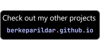

&nbsp;&nbsp;&nbsp;&nbsp;&nbsp;&nbsp;&nbsp;&nbsp;
&nbsp;&nbsp;&nbsp;&nbsp;&nbsp;&nbsp;&nbsp;&nbsp;

# Gem Match !
Gem Match is an addictive puzzle game where players aim to match at least three gems of the same type vertically or horizontally. The game features a grid of colorful gems with six different varieties. Your task is to swap adjacent gems by touching and dragging them to create matching sets. Gems can be swapped to the right, left, down, or upwards, allowing you to strategize and create matches.

## How to Play
- Touch and drag a gem to swap it with an adjacent gem in the desired direction.
- Match at least three gems of the same type vertically or horizontally to destroy them.
- After gems are destroyed, the gems above them in the grid will fall into their place.
- Earn 100 points for each gem destroyed in a match.
- New random gems will fill in the empty spots.
- You have a 10-second time limit from the start of the game.
- Each gem in a match awards you with additional seconds.
- If you run out of time, the game ends.

## Features

- Addictive puzzle gameplay, perfect for quick rounds of brain-teasing fun.
- A colorful grid of gems with six different types for variety.
- Strategize to create big matches and maximize your score.
- Time-based gameplay adds a sense of urgency and excitement.
- Score points for each gem matched and earn additional time.
- Game over screen displays your score and the high score record.
- Continue playing with a fresh 10 seconds by watching a rewarded ad.
- Similar to popular match-three games like Candy Crush, offering familiar and enjoyable gameplay.